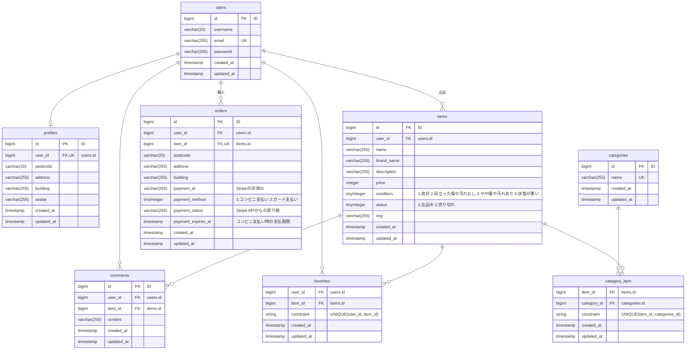

# ER図

```mermaid

erDiagram
%%{init: {'theme': 'default'}}%%
    users ||--o| profiles : ""

    users {
        bigint id PK "ID"
        varchar(20) username
        varchar(255) email UK
        varchar(255) password
        timestamp created_at
        timestamp updated_at
    }

    profiles {
        bigint id PK "ID"
        bigint user_id FK,UK "users.id"
        varchar(20) postcode
        varchar(255) address
        varchar(255) building
        varchar(255) avatar
        timestamp created_at
        timestamp updated_at
    }

    users ||--o{ items : "出品"

    items {
        bigint id PK "ID"
        bigint user_id FK "users.id"
        varchar(255) name
        varchar(255) brand_name
        varchar(255) description
        integer price
        tinyInteger condition "1:良好 2:目立った傷や汚れなし 3:やや傷や汚れあり 4:状態が悪い"
        tinyInteger status "1:出品中 2:売り切れ"
        varchar(255) img
        timestamp created_at
        timestamp updated_at
    }

    users ||--o{ comments : ""

    comments {
        bigint id PK "ID"
        bigint user_id FK "users.id"
        bigint item_id FK "items.id"
        varchar(255) content
        timestamp created_at
        timestamp updated_at
    }

     items ||--o{ comments : ""

    users ||--o{ favorites : ""
    items ||--o{ favorites : ""

    favorites {
        bigint user_id FK "users.id"
        bigint item_id FK "items.id"
        string constraint "UNIQUE(user_id, item_id)"
        timestamp created_at
        timestamp updated_at
    }

    users ||--o{ orders : "購入"

    orders {
        bigint id PK "ID"
        bigint user_id FK "users.id"
        bigint item_id FK,UK "items.id"
        varchar(20) postcode
        varchar(255) address
        varchar(255) building
        varchar(255) payment_id "Stripeの決済ID"
        tinyInteger payment_method "1:コンビニ支払い 2:カード支払い"
        varchar(255) payment_status "Stripe APIからの戻り値"
        timestamp payment_expires_at "コンビニ支払い時の支払期限"
        timestamp created_at
        timestamp updated_at
    }

    categories ||--o{ category_item : ""
    items ||--o{ category_item : ""

    categories {
        bigint id PK "ID"
        varchar(255) name UK
        timestamp created_at
        timestamp updated_at
    }

    category_item {
        bigint item_id FK "items.id"
        bigint category_id FK "categories.id"
        string constraint "UNIQUE(item_id, categories_id)"
        timestamp created_at
        timestamp updated_at
    }
```