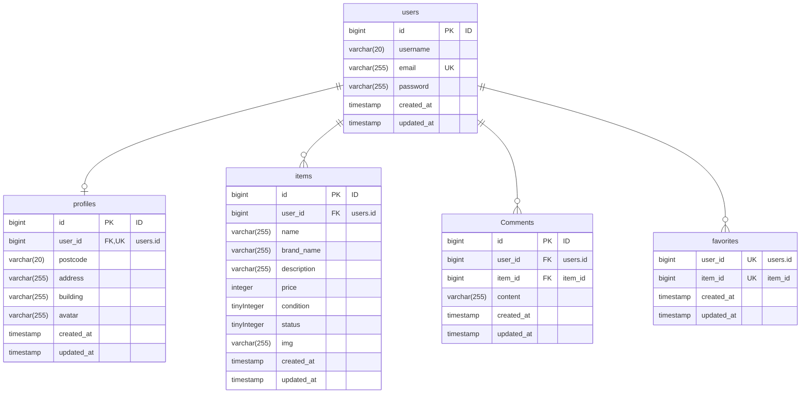

# ER図

```mermaid

erDiagram
    users ||--o| profiles : ""

    users {
        bigint id PK "ID"
        varchar(20) username
        varchar(255) email UK
        varchar(255) password
        timestamp created_at
        timestamp updated_at
    }

    profiles {
        bigint id PK "ID"
        bigint user_id FK,UK "users.id"
        varchar(20) postcode
        varchar(255) address
        varchar(255) building
        varchar(255) avatar
        timestamp created_at
        timestamp updated_at
    }

    users ||--o{ items : ""

    items {
        bigint id PK "ID"
        bigint user_id FK "users.id"
        varchar(255) name
        varchar(255) brand_name
        varchar(255) description
        integer price
        tinyInteger condition
        tinyInteger status
        varchar(255) img
        timestamp created_at
        timestamp updated_at
    }

    users ||--o{ Comments : ""

    Comments {
        bigint id PK "ID"
        bigint user_id FK "users.id"
        bigint item_id FK "item_id"
        varchar(255) content
        timestamp created_at
        timestamp updated_at
    }

     users ||--o{ favorites : ""

    favorites {
        bigint user_id UK "users.id"
        bigint item_id UK "item_id"
        timestamp created_at
        timestamp updated_at
    }
```